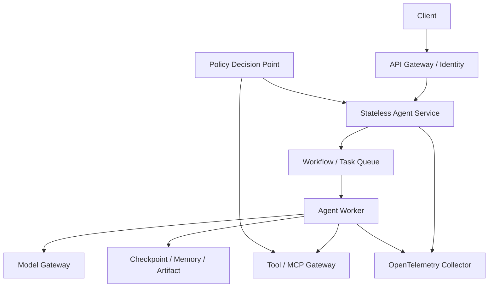

# Deployment Architecture

本目录描述 Agent 从单进程教学程序演进到可扩缩、可恢复的生产服务。

## 部署单元

| 单元 | 是否有状态 | 扩缩依据 |
| --- | --- | --- |
| API/Agent Service | 尽量无状态 | 请求率、延迟 |
| Workflow Worker | Checkpoint 外置 | Queue Depth、任务耗时 |
| Model Gateway | 路由状态可外置 | Token/s、并发、GPU |
| Tool Gateway | 依业务而定 | 调用率、下游配额 |
| Vector/State Store | 有状态 | 数据量、QPS、复制延迟 |

## 生产要求

- Readiness 只在依赖可用且能够接收新 Run 时通过；
- Graceful Shutdown 停止接收任务并保存进行中状态；
- Run 使用幂等键，重试不重复产生外部副作用；
- Secret 由部署平台注入，不进入镜像、Prompt 或 Trace；
- 数据地域、租户和网络策略在基础设施层强制执行；
- Auto Scaling 同时考虑 Queue、Token、外部配额和成本；
- Model/Prompt/Policy/Tool 版本支持 Canary 与回滚。

Chapter 33 的 [`deployment_runtime`](../../chapters/chapter33/deployment_runtime/) 提供 HTTP、Health、Dockerfile 和 Kubernetes 教学配置；它不包含生产队列、TLS、持久化和 Secret Manager。
