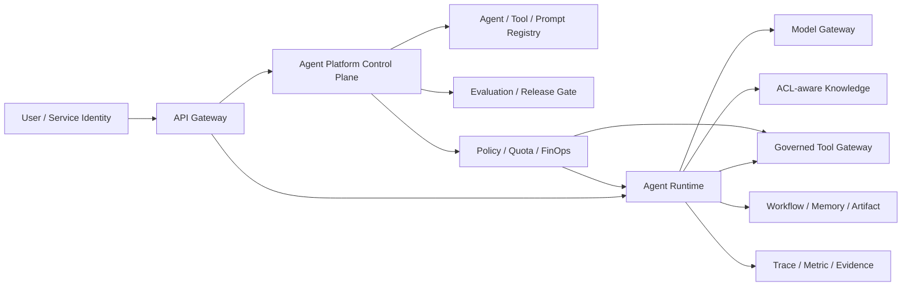

# Enterprise Agent Architecture

企业架构的核心不是增加更多 Agent，而是把身份、数据、能力、治理和运营放在同一信任模型中。

## Trust Boundaries

1. 用户输入、网页、邮件和检索内容都是不可信数据；
2. 模型输出是 Proposal，不是授权；
3. Runtime 校验 Schema、预算、状态和依赖；
4. Policy 使用服务端身份决定 Scope 和 Action Risk；
5. Tool Gateway 执行最小权限并产生 Evidence；
6. 企业系统用数据库、IAM 和事务维护最终不变量。

## Control Plane / Runtime Plane / Data Plane

Control Plane 管理 Agent、Prompt、Tool、Policy、Eval 和发布版本；Runtime Plane 接收任务并执行状态循环；Data Plane 保存知识、Checkpoint、Memory、Artifact 和审计证据。三者可以由同一产品提供，但职责必须可区分。

## 上线门禁

- Owner、数据分类和 SLO 已声明；
- Offline Eval 与安全 Suite 达标；
- Scope、租户、地域和 Secret 完成威胁建模；
- 高风险动作具备审批、幂等和补偿；
- Trace 可关联 Model、Prompt、Tool、Policy 和数据版本；
- 有 Shadow/Canary、人工接管、回滚和停机方案。

完整理论见 Chapter 23、28–30、49–51；业务落点见 Part VI。
