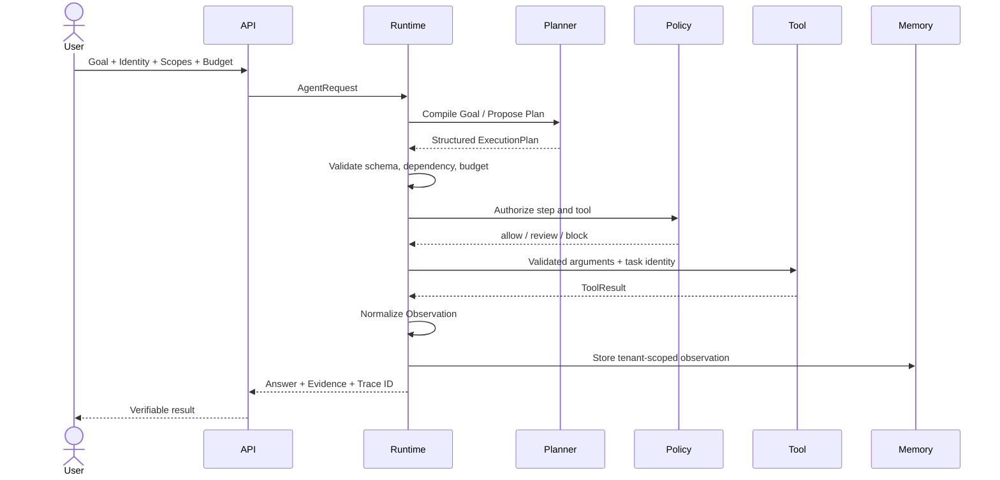

# Agent Run Sequence

本目录描述一次完整 Agent Run 的交互顺序，以及模型、Runtime 和外部 Tool 的责任边界。

## 关键约束

- API 从认证上下文构造身份和 Scope，不能信任模型传入的 `tenant_id`；
- Planner 返回提案，不直接执行 Tool；
- Tool Result 作为不可信 Observation，不升级为系统指令；
- Error、Retry、Approval 和 Cancel 都要成为显式事件；
- 最终答案引用 Evidence，而不是只返回自然语言。

## 失败分支

Schema 或权限失败立即终止；瞬时执行失败可在预算内重试；高风险副作用进入 Human Approval；长任务在等待时保存 Checkpoint 并释放计算资源。

可运行映射：[`framework/runtime/agent.py`](../../framework/runtime/agent.py) 与 [`examples/sql-agent/`](../../examples/sql-agent/README.md)。
