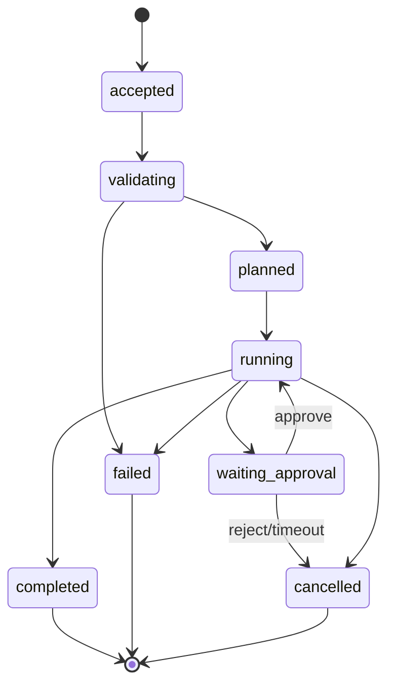

# Agent State Machine

Agent 本质上是一个被事件驱动的有状态执行系统。自然语言可以描述结果，只有 State Machine 能决定 Run 当前是否合法。

## 事件契约

每个事件至少包含 `event_id`、`run_id`、`sequence`、`type`、`occurred_at`、`actor`、`payload` 和 `schema_version`。副作用事件还应保存 Idempotency Key 与 Evidence 引用。

## 恢复原则

- Checkpoint 保存确定性状态与外部结果，不依赖重新采样模型输出；
- Replay 必须按 Sequence 验证，不接受缺失或重复事件；
- 已执行写操作不能通过简单重试再次执行；
- Approval 绑定具体 Proposal Hash，内容变化后旧批准失效；
- Terminal State 不允许被模型文本恢复为 Running。

教学实现见 Chapter 20 的 [`state_machine_runtime`](../../chapters/chapter20/state_machine_runtime/)；带人工暂停/恢复的 DAG 见 Chapter 21。
