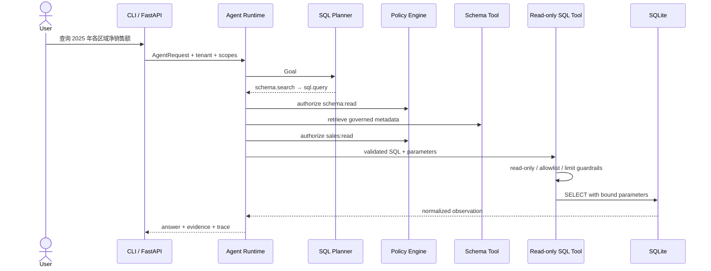

# SQL Agent：企业级 Agent Runtime 参考案例

这个案例不是“让模型拼一段 SQL”的演示，而是一条从用户目标到授权查询、证据答案和运行 Trace 的完整 Agent 链路。

当前版本：`v0.1.0`

## 业务场景

销售分析人员提出：

> 查询 2025 年各区域净销售额。

系统需要理解指标和筛选条件，检索受治理的 Schema，构造执行计划，校验数据权限，以只读账户执行参数化 SQL，并返回可以追溯到查询结果的答案。

## 架构



## 这个案例体现了哪些底层能力

| 能力 | 案例落点 |
|---|---|
| Goal | 将自然语言请求转换为完成条件和执行约束 |
| Planning | 创建 Schema 发现与 SQL 查询两个依赖 Step |
| Function Calling | Tool Registry 和 Pydantic 参数 Schema |
| Guardrails | Scope、只读 SQL、单语句、表白名单、结果上限 |
| Observation | 统一 SQL、参数、行数、结果和错误 |
| Memory | 按 tenant/run 保存 Observation |
| State Machine | accepted → running → completed/failed |
| Observability | Goal、Plan、Tool、Run 的结构化时间线 |
| Evidence | 答案携带实际 SQL、绑定参数和查询结果 |
| Deployment | CLI、FastAPI、Docker Compose |

## 环境要求

- Python 3.11+
- SQLite 3
- Docker 24+，仅容器运行时需要

依赖分为两层：

| 文件 | 内容 |
|---|---|
| `framework/requirements.txt` | Runtime 核心依赖 |
| `examples/sql-agent/requirements.txt` | FastAPI 与 Uvicorn |
| 根目录 `requirements.txt` | 聚合上述运行依赖 |
| 根目录 `requirements-dev.txt` | pytest、Ruff、mypy |

## 本地安装

在仓库根目录执行：

```bash
python3.11 -m venv .venv
source .venv/bin/activate
python -m pip install --upgrade pip
python -m pip install -r requirements.txt
python -m pip install -e .
```

复制配置：

```bash
cp examples/sql-agent/.env.example .env
```

当前代码直接读取系统环境变量，不自动加载 `.env`。可以用部署平台注入，或手动执行：

```bash
export SQL_AGENT_DATABASE=var/sql-agent.db
```

## CLI 运行

```bash
python examples/sql-agent/main.py "查询 2025 年各区域净销售额" --show-trace
```

查询单个区域：

```bash
python examples/sql-agent/main.py "查询 2025 年华东净销售额"
```

首次启动会自动创建 `var/sql-agent.db` 并载入公开演示数据。

预期答案包含：

```text
查询结果如下：
- 华东：净销售额 338,000.00 CNY，订单 2 笔
- 华北：净销售额 149,000.00 CNY，订单 2 笔
- 华南：净销售额 148,000.00 CNY，订单 2 笔
```

实际排序由 SQL 查询结果决定。

## API 运行

```bash
uvicorn sql_agent.api:app \
  --app-dir examples/sql-agent \
  --host 0.0.0.0 \
  --port 8080
```

创建 Run：

```bash
curl -X POST http://localhost:8080/runs \
  -H 'Content-Type: application/json' \
  -d '{
    "objective": "查询 2025 年各区域净销售额",
    "tenant_id": "demo",
    "actor_id": "engineer-001"
  }'
```

查看 Trace：

```bash
curl http://localhost:8080/runs/<run_id>/trace
```

健康检查：

```bash
curl http://localhost:8080/healthz
curl http://localhost:8080/readyz
```

## Docker Compose

```bash
docker compose -f examples/sql-agent/docker-compose.yml up --build
```

容器使用只读根文件系统，SQLite 数据仅写入命名 Volume。

## 代码结构

```text
examples/sql-agent/
├── main.py                  # CLI
├── requirements.txt
├── .env.example
├── Dockerfile
├── docker-compose.yml
├── data/
│   ├── schema.sql
│   └── seed.sql
├── sql_agent/
│   ├── application.py      # 组件装配
│   ├── planner.py          # 教学版确定性 Planner
│   ├── tools.py            # Schema 与 SQL Tool
│   ├── guardrails.py       # SQL 第一层安全策略
│   ├── database.py         # SQLite 只读 Adapter
│   ├── answer.py           # 基于证据的答案合成
│   └── api.py              # FastAPI Adapter
└── tests/
    └── test_sql_agent.py
```

## 为什么 v0.1 使用确定性 Planner

这个案例首先验证 Runtime 和安全边界，因此默认 Planner 不依赖网络或模型密钥。它把有限的销售分析目标转换为结构化 Plan 和参数化 SQL，可以让读者离线观察完整生命周期。

后续会增加 Model Gateway。LLM 负责生成候选指标、维度和 SQL IR，Runtime 仍然负责：

- JSON Schema 校验；
- Semantic Layer 指标映射；
- Scope 和数据权限；
- SQL AST 校验；
- 数据库只读账户；
- Query Timeout 和资源配额；
- Evidence 与审计。

接入模型不能删除这些确定性边界。

## 安全说明

演示 API 会给本地请求固定授予 `schema:read` 和 `sales:read`，目的是展示 Runtime 授权路径，不代表生产身份认证。生产环境必须从 API Gateway、OIDC/JWT 或企业 IAM 派生 tenant、actor 和 scopes，禁止接受客户端自报权限。

当前 SQL Guardrail 拒绝：

- 非 `SELECT`/`WITH` 语句；
- 多语句；
- DDL 和 DML 关键字；
- 白名单之外的表；
- 超出上限的 `LIMIT`。

但字符串检查不能替代生产安全。企业部署至少还需要：

1. 使用 SQL Parser/AST 进行语法树检查；
2. 使用独立只读数据库账户；
3. 在数据库实施 Row-Level/Column-Level Security；
4. 对查询设置超时、扫描量和并发限制；
5. 对敏感字段做脱敏和输出策略；
6. 将指标定义放入版本化 Semantic Layer；
7. 对每次 SQL、参数、数据版本和调用者做审计。

## 建议测试

```bash
pytest framework/tests examples/sql-agent/tests
ruff check framework examples/sql-agent
mypy framework
```

## 下一阶段

- 增加 OpenAI、Anthropic、Google 和本地模型的 Model Gateway
- 使用结构化输出生成 SQL IR，而不是直接信任 SQL 字符串
- 引入 PostgreSQL 与原生数据权限
- 引入 Embedding Schema Retrieval
- 建立 Text-to-SQL 离线评测数据集
- 增加 Query Cost、Latency 和 Execution Accuracy 指标
