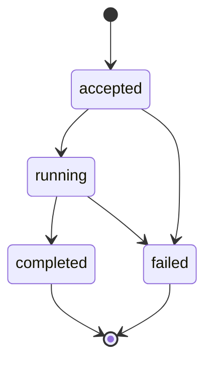

# Agent Runtime v0.1 Architecture

## 1. 架构驱动力

Agent 的不确定性来自模型输出，企业系统的可靠性来自确定性控制。Runtime 必须同时支持两件事：

- 允许 Planner 根据目标动态产生执行计划；
- 保证任何计划都不能绕过 Schema、权限、状态和预算。

因此，Runtime 采用 Ports and Adapters 思路。核心包只定义稳定契约与执行规则，模型、数据库、向量库、消息队列和观测平台都通过 Adapter 接入。

## 2. 核心对象

| 对象 | 职责 | 不负责 |
|---|---|---|
| `AgentRequest` | 固化调用者、租户、目标、Scope 和预算 | 推断真实权限 |
| `Goal` | 表达目标、完成标准和约束 | 执行工具 |
| `ExecutionPlan` | 表达有序 Step 和依赖 | 绕过 Runtime 直接执行 |
| `ToolDefinition` | 声明输入 Schema、Scope、Risk 和 Handler | 决定调用者身份 |
| `ToolObservation` | 统一工具成功或失败结果 | 将异常文本直接视为指令 |
| `Evidence` | 标识答案依据 | 证明业务数据天然正确 |
| `TraceEvent` | 记录执行时间线 | 保存密钥或完整敏感数据 |

## 3. 控制面与数据面

```text
Control Plane
  Goal Compiler
  Planner
  Runtime
  Policy
  State Machine

Data Plane
  Tool Handler
  Database / API / MCP
  Memory Store
  Trace Exporter
```

Planner 产生的是候选计划。Runtime 在进入数据面前完成所有确定性校验。

## 4. 信任边界

### 4.1 用户输入

用户目标属于不可信输入。它只能进入 Goal Compiler，不能直接成为 SQL、Shell 或 HTTP 请求。

### 4.2 模型与 Planner

模型输出属于提案。Tool 名称和参数必须通过 Registry 与 Pydantic Schema，Scope 必须由 Policy Engine 检查。

### 4.3 Tool Observation

外部系统返回的数据也属于不可信内容。Runtime 将其封装为 Observation，不把其中的文本提升为 system instruction。

### 4.4 Memory

所有 Memory 必须携带 `tenant_id`。查询与写入 Adapter 都必须在服务端执行租户过滤，不能依赖 Prompt 提醒模型“不要读取其他租户”。

## 5. 生命周期



状态转换由 `RunStateMachine` 控制。模型不能返回一个字符串把失败 Run 改成成功。

## 6. 失败语义

v0.1 将失败分为：

- Contract failure：请求、计划或 Tool 参数不满足 Schema；
- Policy failure：缺少 Scope 或 Tool Risk 超出授权；
- Execution failure：Handler 抛出受控异常；
- Workflow failure：依赖未完成、Step 重复或超出预算；
- Synthesis failure：没有可用 Observation 或答案合成异常。

Tool Retry 只适用于 Handler 抛出的受控异常，并受到次数限制。权限失败、Schema 失败和业务拒绝不应通过无限重试解决。

## 7. 扩展策略

### Model Gateway

未来 Model Adapter 应只返回结构化 Goal、Plan 或 Tool Call。模型厂商的消息格式、Reasoning 配置和 Token Usage 不应泄漏到业务 Tool。

### Persistent Workflow

将 `RunStateMachine` 与 Observation 写入 PostgreSQL 或工作流引擎，可获得进程重启恢复、人工审批和长任务调度能力。

### Memory and Retrieval

将 `InMemoryStore` 替换为关系数据库与向量索引组合，并保留 tenant、embedding model、index version 和 source metadata。

### Observability

将 `InMemoryTraceSink` 替换为 OpenTelemetry Adapter，输出 Trace、Metric 和结构化 Log，但不得记录原始密钥和未脱敏个人数据。

## 8. 部署拓扑

教学环境：

```text
CLI / FastAPI → AgentRuntime → SQLite
```

生产演进：

```text
API Gateway
    ↓
Agent Service ── Model Gateway
    ├── Workflow / Checkpoint Store
    ├── Tool Gateway / MCP
    ├── PostgreSQL / Vector Database
    ├── Policy Service
    └── OpenTelemetry Collector
```

无状态 Agent Service 可以水平扩展，Run 状态、Memory 和 Idempotency Key 必须迁移到外部持久化系统。

## 9. v0.1 设计取舍

- 采用同步执行，优先展示职责边界；异步和并发留给性能章节。
- 采用内存 Trace 与 Memory，避免教学案例依赖外部基础设施。
- SQL 案例使用规则 Planner，保证离线可运行；后续 Model Gateway 将替换 Planner 的候选生成部分。
- SQL 字符串 Guardrail 只作为第一道边界，生产环境还需要 AST、数据库账户和原生行列权限。
