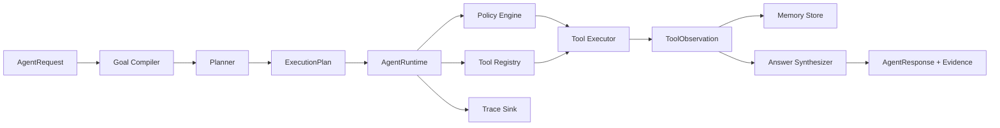

# AI Agent Engineering Runtime

`framework/` 是本教程从 Chapter 12–33 逐章实现的能力汇总，也是后续所有企业案例的统一运行时。

当前版本：`v0.1.0`

## 工程目标

这不是对某个 Agent 框架的二次封装，而是一套用于理解 Agent 内部工作原理的教学型 Runtime。它把概率性的模型推理和确定性的工程控制分开：

```text
Model / Planner
    生成 Goal、Plan、Tool Call 候选
                ↓
Agent Runtime
    校验 Schema、状态、权限、预算和依赖
                ↓
Tool / Memory / External System
    执行被授权的确定性操作
```

读者可以先理解这套 Runtime，再把同一职责映射到 OpenAI Agents SDK、LangGraph、Google ADK 等成熟框架。

## 已实现能力

- Pydantic 领域契约：Request、Goal、Plan、Step、Observation、Evidence、Response
- 可替换的 Goal Compiler、Planner 和 Answer Synthesizer
- Tool Registry、JSON Schema 和输入验证
- Tenant、Scope 和 Tool Risk 确定性授权
- Plan 步数预算、依赖顺序和重复 Step 校验
- Tool 有限重试与统一 Observation
- Run 状态机
- Tenant 隔离的教学版 Memory
- 有序 Trace Event
- CLI/API/容器案例所需的稳定 Python 包

## 当前不包含

- 通用的厂商模型 SDK 适配
- 分布式任务队列和持久化 Checkpoint
- 生产级向量数据库
- 数据库原生的行列级权限
- OpenTelemetry Exporter
- Human-in-the-loop 审批节点

这些能力会在 `integrations/`、Part V 框架分析和后续企业案例中逐步加入。v0.1 先保证 Runtime 边界清楚，而不是一次实现完整 Agent Platform。

## 架构



更完整的组件职责、信任边界和演进路线见 [ARCHITECTURE.md](ARCHITECTURE.md)。

## 目录结构

```text
framework/
├── contracts.py             # 跨组件稳定数据契约
├── config.py                # 环境配置
├── planner/                 # Goal、Plan 和答案合成扩展点
├── tools/                   # Tool 定义与注册
├── policy/                  # Scope 与风险授权
├── executor/                # 输入校验、执行和重试
├── workflow/                # 生命周期状态机
├── memory/                  # Memory Port 与参考实现
├── observability/           # Trace Port 与参考实现
├── runtime/                 # Agent 主循环与组件装配
├── tests/                   # Runtime 契约测试
└── requirements.txt         # 核心依赖
```

## 环境要求

- Python 3.11+
- pip 23+
- macOS、Linux 或 Windows

核心 Runtime 只有一个第三方依赖：

| 依赖 | 用途 |
|---|---|
| `pydantic` | 领域模型、Tool 入参、配置和 Schema 校验 |

## 安装

在仓库根目录执行：

```bash
python3.11 -m venv .venv
source .venv/bin/activate
python -m pip install --upgrade pip
python -m pip install -e .
```

安装 Runtime 与全部案例依赖：

```bash
python -m pip install -r requirements.txt
```

安装开发工具：

```bash
python -m pip install -r requirements-dev.txt
```

## 第一个端到端案例

```bash
python examples/sql-agent/main.py "查询 2025 年各区域净销售额" --show-trace
```

SQL Agent 的完整说明见 [examples/sql-agent/README.md](../examples/sql-agent/README.md)。

## Runtime 执行流程

1. `AgentRequest` 固化租户、用户、目标、Scope 和预算。
2. Goal Compiler 将自然语言目标转换为可检查的 `Goal`。
3. Planner 产生带依赖和权限声明的 `ExecutionPlan`。
4. Runtime 检查 Step 数量、唯一性和依赖顺序。
5. Policy Engine 合并 Step 与 Tool 所需 Scope。
6. Tool Registry 验证工具存在性和输入 Schema。
7. Executor 执行工具并产生统一 `ToolObservation`。
8. Memory 保存运行内 Observation，Trace 保存时间线。
9. Answer Synthesizer 只基于成功 Observation 组织答案和 Evidence。
10. 状态机将 Run 转换为 `completed` 或 `failed`。

## 扩展一个业务 Agent

业务 Agent 至少实现三个扩展点：

```python
from framework import AgentRuntime
from framework.planner import DeterministicGoalCompiler

runtime = AgentRuntime(
    goal_compiler=DeterministicGoalCompiler(),
    planner=BusinessPlanner(),
    answer_synthesizer=BusinessAnswerSynthesizer(),
    tools=business_tool_registry,
)
```

业务代码负责：

- 领域目标和指标语义
- 计划策略
- Tool 实现
- 业务权限声明
- 答案格式和 Evidence

Runtime 负责：

- 契约、状态和预算
- 授权边界
- Tool 输入验证与执行
- Observation、Memory 和 Trace

## 配置

| 环境变量 | 默认值 | 说明 |
|---|---:|---|
| `AGENT_ENV` | `development` | 运行环境 |
| `LOG_LEVEL` | `INFO` | 日志级别 |
| `AGENT_MAX_STEPS` | `8` | 单次运行最大步骤数 |
| `AGENT_MAX_RETRIES` | `1` | Tool 默认重试次数 |
| `SQL_AGENT_DATABASE` | `var/sql-agent.db` | SQL Agent SQLite 路径 |

密钥不应提交到仓库。案例使用 `.env.example` 说明变量，但核心代码不自动加载 `.env`，生产环境应由容器、Secret Manager 或部署平台注入。

## 与章节的关系

| Runtime 模块 | 对应章节 |
|---|---|
| `contracts.py`、`runtime/` | Chapter 12、18、23 |
| `planner/` | Chapter 13、14、19 |
| `tools/`、`executor/` | Chapter 10、15 |
| `memory/` | Chapter 7、16、17 |
| `workflow/` | Chapter 20、21 |
| `policy/` | Chapter 28 |
| `observability/` | Chapter 30 |
| `config.py`、API、Docker | Chapter 31–33 |

## 开发与质量门禁

开发约定、测试、Lint 和类型检查命令见 [DEVELOPMENT.md](DEVELOPMENT.md)。

本 Runtime 的设计原则是：

> 模型可以提出下一步做什么，但不能自行决定是否有权执行。
